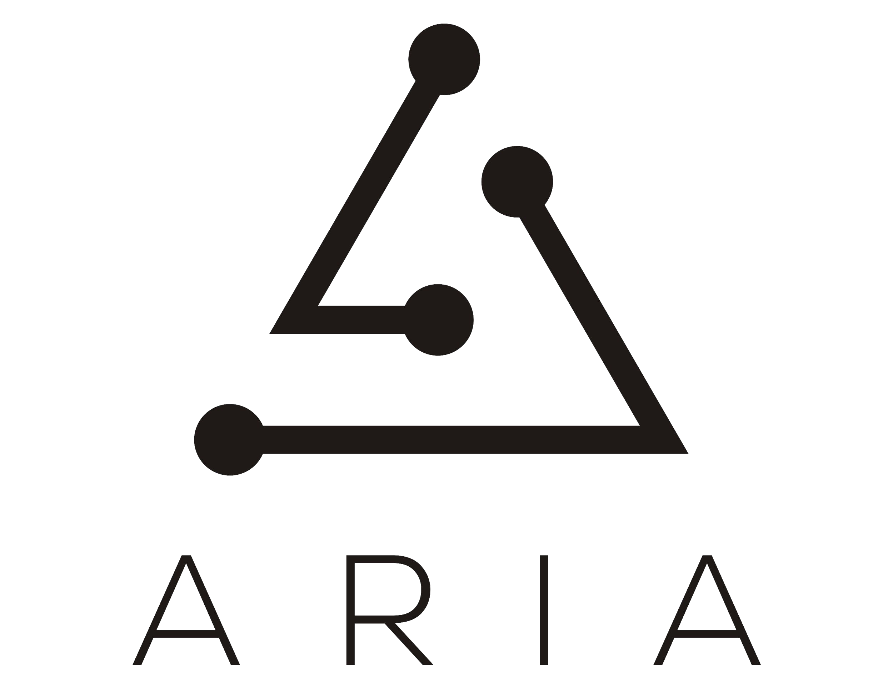

<!-- Slider Start -->
<section id="slider">
	

		

			

				

					<h1 class="animated fadeInUp">Apache ARIA TOSCA   ORCHESTRATION ENGINE</h1>
					
 Embeddable lightweight library and command line tool 
					For NFV and Hybrid Cloud Orchestration

				

			

		

	

</section>

<!-- Wrapper Start -->
<section id="intro">
	

		

			

				

					

						<h2>About Apache ARIA TOSCA</h2>
						

					

					
ARIA TOSCA is an open, light, CLI-driven library of orchestration tools that other open projects can consume to easily build TOSCA-based orchestration solutions. ARIA is now an incubation project at the Apache Software Foundation.

				

			
<!-- .col-md-7 close -->
			

				

					
				

			
<!-- .col-md-5 close -->
		

	

</section>

<section id="feature">
	

		

			

				<h2>Open Source, Open Governance</h2>
				
OASIS TOSCA offers a vendor neutral standard for modeling cloud based applications, ARIA is an open implementation of the TOSCA specification, allowing complete visibility and free use of all it’s source code https://github.com/apache/incubator-ariatosca

				
AIRA is an Apache Software Foundation project in incubation process, aiming to become an independent project governed by it’s active contributors following a meritocratic model. Committers of project will be leading the project’s direction and influencing thought contribution.

				<a href="https://www.apache.org/foundation/how-it-works.html" class="btn btn-view-works">Learn More</a>
			

		

	

</section>
<!-- Call to action Start -->
<section id="call-to-action">
	

		

			

				

					<h2>Get Started with Apache ARIA TOSCA</h2>
					

					<a class="btn btn-default btn-call-to-action" href="/getting-started" >Get Started Now</a>
				

			

		

	

</section>
